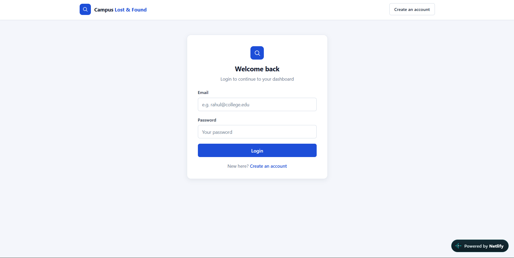
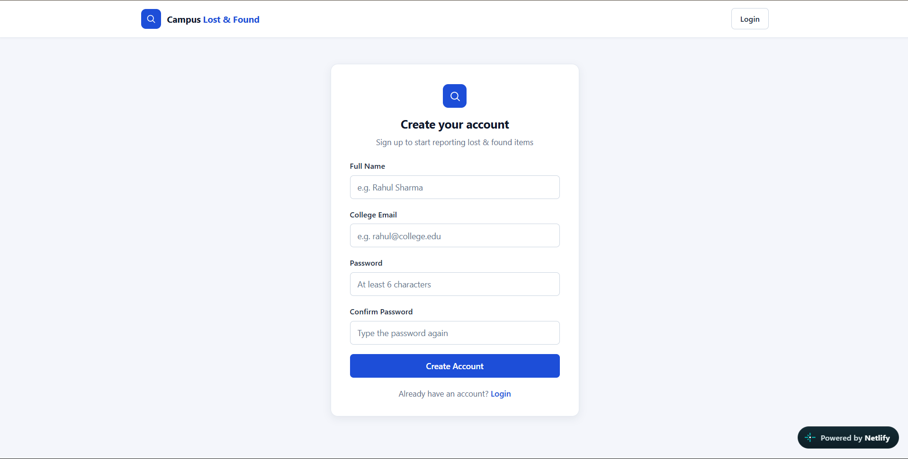
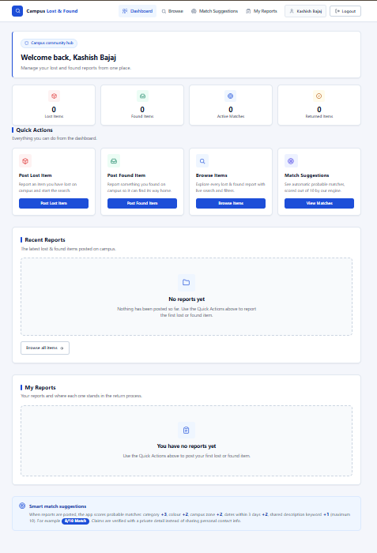
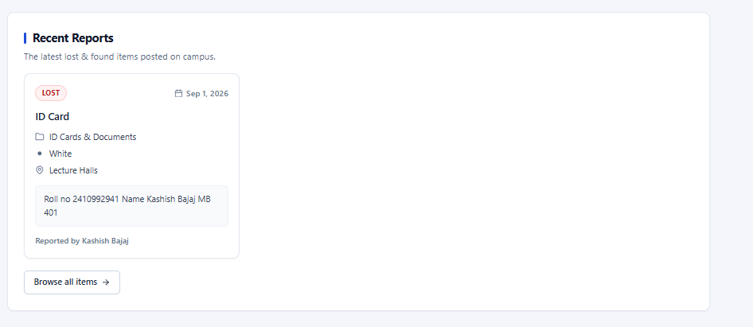

# 🔎 Lost & Found Management System

A web-based Lost & Found Management System designed to help users report, search, and manage lost and found items in an organized way.

The application provides a simple interface where users can create an account, log in, submit lost or found item reports, browse recent reports, and find relevant information about items reported by other users.

The main goal of this project is to make the process of reporting and finding lost belongings easier, faster, and more organized.

Live Demo : https://campuslost-and-found.netlify.app/

---

# 📌 Table of Contents

* [Project Overview](#-project-overview)
* [Problem Statement](#-problem-statement)
* [Objectives](#-objectives)
* [Key Features](#-key-features)
* [Application Flow](#-application-flow)
* [Screenshots](#-screenshots)

  * [Login](#1-login-page)
  * [Sign Up](#2-sign-up-page)
  * [Dashboard](#3-dashboard)
  * [Lost & Found](#4-lost--found)
  * [Recent Reports](#5-recent-reports)
  * [Report an Item](#6-report-an-item)
  * [Report Details](#7-report-details)
* [How the System Works](#-how-the-system-works)
* [User Journey](#-user-journey)
* [Technology Stack](#-technology-stack)
* [Project Structure](#-project-structure)
* [Installation & Setup](#-installation--setup)
* [Future Enhancements](#-future-enhancements)
* [Conclusion](#-conclusion)

---

# 🚀 Project Overview

The Lost & Found Management System is developed to provide a centralized platform for managing lost and found items.

In real-world environments such as colleges, universities, offices, hostels, libraries, malls, and public places, people frequently lose personal belongings. Finding these belongings can be difficult because there is often no centralized system where users can report and search for lost items.

This project solves that problem by providing a digital platform where users can:

* Create an account
* Log in to the system
* Report lost items
* Report found items
* Browse recently submitted reports
* View information about reported items
* Search for relevant lost or found belongings
* Connect the information about lost and found items in one place

The system focuses on providing a simple and user-friendly experience so that users can quickly submit or find an item report.

---

# ❗ Problem Statement

When a person loses an important belonging, such as a wallet, mobile phone, ID card, bag, keys, documents, or other personal items, finding it can be difficult.

Traditional lost-and-found processes usually depend on:

* Verbal communication
* Notice boards
* Social media groups
* Manual registers
* Informal messages

These approaches are not always efficient because information can become difficult to track and users may not know where to look.

The proposed Lost & Found Management System provides a centralized digital solution where information about lost and found items can be stored and accessed easily.

---

# 🎯 Objectives

The main objectives of the project are:

1. To provide users with an easy platform for reporting lost items.
2. To allow users to report items they have found.
3. To display recent lost and found reports.
4. To organize item information in a structured manner.
5. To make searching for lost belongings easier.
6. To provide a user-friendly interface.
7. To provide authentication through Login and Sign Up.
8. To reduce the dependency on manual lost-and-found processes.
9. To create a centralized database of reported items.
10. To improve the chances of reconnecting lost items with their owners.

---

# ✨ Key Features

## 🔐 1. User Authentication

The system provides authentication functionality through Login and Sign Up.

New users can create an account using the registration page, while existing users can log in to access the application.

### Benefits

* User account creation
* Secure login flow
* Personalized user experience
* Restricted access to user-specific functionality

---

# 📸 Screenshots

## 1. Login Page

The Login Page is the entry point for existing users.

Users can enter their registered credentials and access the Lost & Found application.



### What this page provides

* User login
* Input fields for credentials
* Authentication access
* Navigation towards account creation

The login interface is designed to keep the authentication process simple and easy to understand.

---

## 2. Sign Up Page

The Sign Up Page allows new users to create an account before using the application.



### What this page provides

* New user registration
* Required user information
* Account creation
* Navigation back to Login

After successfully creating an account, the user can use the Login Page to access the application.

---

# 🏠 3. Dashboard

After authentication, the user is taken to the main application/dashboard.



The dashboard acts as the central point of the application.

From here, users can access important functionality such as:

* Lost item reports
* Found item reports
* Recent reports
* Reporting a new item
* Viewing item information

The dashboard is designed to provide quick access to the major features of the system.

---

# 🔎 4. Lost & Found Page

The Lost & Found section contains reports related to lost and found belongings.


Users can use this section to browse available reports and identify items that may be relevant to them.

Each report can contain important information such as:

* Item name
* Item category
* Description
* Location
* Date
* Status
* Additional information
* Image of the item, where available

This makes it easier for users to compare their lost belongings with the reports available in the system.

---

# 🕒 5. Recent Reports

The Recent Reports section displays newly submitted reports.



This feature allows users to quickly see what has recently been reported.

For example, if a user recently lost a wallet or phone, they can check recent reports to see whether someone has submitted a corresponding found-item report.

### Advantages

* Quick access to new reports
* Easier discovery of recently found items
* Keeps users updated
* Reduces the time required to search through old reports

---

# 📝 6. Report an Item

The reporting functionality allows users to submit information about a lost or found belonging.


A user can provide relevant information about the item so that other users can identify it.

Depending on the implementation, the report may include:

* Item name
* Category
* Description
* Location
* Date
* Item status
* Image
* Additional details

After submission, the report becomes available in the system.

---

# 📄 7. Report Details

Users can open an individual report to view more detailed information.


The details page provides a complete view of the selected report.

It can help users determine whether the reported item matches the belongings they have lost or found.

---

# 🔄 Application Flow

The overall application flow can be represented as:

```text
                 ┌───────────────┐
                 │   Start App   │
                 └───────┬───────┘
                         │
                         ▼
                ┌─────────────────┐
                │  Login / Sign Up│
                └────────┬────────┘
                         │
                         ▼
                  ┌─────────────┐
                  │  Dashboard  │
                  └──────┬──────┘
                         │
          ┌──────────────┼──────────────┐
          │              │              │
          ▼              ▼              ▼
    ┌───────────┐  ┌────────────┐  ┌──────────────┐
    │Lost Items │  │Found Items │  │Recent Reports│
    └─────┬─────┘  └──────┬─────┘  └──────┬───────┘
          │               │               │
          └───────────────┼───────────────┘
                          │
                          ▼
                   ┌──────────────┐
                   │Report Details│
                   └──────────────┘
```

---

# 👤 User Journey

A typical user interaction with the application works as follows:

### Step 1 — Create an Account

A new user opens the application and creates an account through the Sign Up page.

### Step 2 — Login

After registration, the user logs into the system using their credentials.

### Step 3 — Access Dashboard

After successful authentication, the dashboard becomes available.

### Step 4 — Browse Reports

The user can browse lost and found reports available in the system.

### Step 5 — Check Recent Reports

The user can check recently submitted reports to quickly identify new information.

### Step 6 — Submit a Report

If the user has lost or found an item, they can create a new report.

### Step 7 — View Details

Users can open individual reports to view complete information about an item.

---

# ⚙️ How the System Works

The application follows a basic client-server/data-management workflow.

```text
User
 │
 ▼
Frontend Interface
 │
 ▼
Authentication / Application Logic
 │
 ▼
Backend
 │
 ▼
Database
 │
 ▼
Stored Lost & Found Reports
```

When a user performs an action, the application processes the request and updates or retrieves the relevant information.

For example:

### Reporting a Lost Item

```text
User
 ↓
Opens Report Form
 ↓
Enters Item Information
 ↓
Submits Report
 ↓
Backend Processes Request
 ↓
Information Stored
 ↓
Report Appears in Lost & Found
```

### Finding an Item

```text
User
 ↓
Opens Lost & Found
 ↓
Browses / Searches Reports
 ↓
Selects Relevant Report
 ↓
Views Report Details
 ↓
Checks Item Information
```

---

# 🧩 Main Modules

## 1. Authentication Module

Responsible for:

* Registration
* Login
* User authentication
* User session/access management

---

## 2. Lost Item Module

Responsible for:

* Creating lost-item reports
* Displaying lost items
* Viewing lost-item information

---

## 3. Found Item Module

Responsible for:

* Creating found-item reports
* Displaying found items
* Viewing found-item information

---

## 4. Recent Reports Module

Responsible for displaying recently created reports so users can quickly access the latest information.

---

## 5. Report Management Module

Responsible for storing and displaying information associated with individual reports.

---

# 🛠️ Technology Stack

The exact technologies used in the project are:

### Frontend

* `[Frontend Technology]`

### Backend

* `[Backend Technology]`

### Database

* `[Database Technology]`

### Authentication

* `[Authentication Technology]`

### Development Tools

* VS Code
* Git / GitHub
* Browser Developer Tools

> The technologies above can be updated according to the actual implementation of the project.

---

# 📁 Project Structure

A typical structure of the project is:

```text
Lost-And-Found/
│
├── frontend/
│   ├── components/
│   ├── pages/
│   ├── assets/
│   └── ...
│
├── backend/
│   ├── routes/
│   ├── controllers/
│   ├── models/
│   └── ...
│
├── screenshots/
│   ├── login.png
│   ├── signup.png
│   ├── dashboard.png
│   ├── lost-found.png
│   ├── recent-reports.png
│   ├── report-item.png
│   └── report-details.png
│
└── README.md
```

The `screenshots` directory contains the images used in this README to visually explain the application's functionality.

---

# 💻 Installation & Setup

## 1. Clone the Repository

```bash
git clone <repository-url>
```

## 2. Navigate to the Project

```bash
cd Lost-And-Found
```

## 3. Install Dependencies

```bash
npm install
```

> If the project uses a different package manager or separate frontend/backend setup, these commands should be adjusted accordingly.

## 4. Configure Environment Variables

Create the required environment configuration file and add the necessary credentials/configuration.

Example:

```env
DATABASE_URL=your_database_url
API_KEY=your_api_key
```

## 5. Start the Application

```bash
npm run dev
```

The application can then be opened in the browser using the local development URL provided by the project.

---

# 🔒 Security Considerations

The application includes an authentication layer to prevent unauthorized access to protected functionality.

Important security practices for a production-ready version include:

* Password hashing
* Secure authentication
* Input validation
* Authorization checks
* Protected API endpoints
* Secure environment variables
* Database security

Sensitive credentials should never be committed directly into the source-code repository.

---

# 📈 Future Enhancements

The project can be extended with several additional features.

## 🔔 Notifications

Users could receive notifications when a potentially matching item is reported.

## 🤖 AI-Based Matching

AI could be used to compare lost and found reports based on:

* Item description
* Category
* Location
* Date
* Images

This could automatically identify potentially matching reports.

## 📍 Location-Based Search

Users could search for reports near a particular location.

## 📷 Image-Based Search

Users could upload an image of a lost item and the system could search for visually similar found-item reports.

## 💬 User Communication

A secure messaging system could allow users to communicate regarding a particular report.

## 📊 Admin Dashboard

An administrator could manage:

* Users
* Reports
* Categories
* Suspicious reports
* Resolved cases

## ✅ Report Status

Reports could have statuses such as:

```text
Active
Under Review
Matched
Resolved
Closed
```

This would make it easier to track the complete lifecycle of a lost or found item.

---

# 🌟 Advantages of the System

The Lost & Found Management System provides several advantages:

* Centralized management of reports
* Easy user registration and login
* Simple reporting process
* Faster access to recent reports
* Organized item information
* Better visibility of lost and found belongings
* Reduced dependency on manual processes
* Scalable architecture for future improvements

---

# 🎓 Use Cases

The system can be used in:

* Colleges and Universities
* Schools
* Offices
* Hostels
* Libraries
* Shopping Malls
* Airports
* Railway Stations
* Corporate Campuses
* Public Events

For example, in a college environment, a student who loses an ID card can submit a lost-item report. Another student who finds the ID card can submit a found-item report. Both reports can then be viewed through the centralized system.

---

# 🧪 Testing

The application should be tested for different user scenarios.

### Authentication Testing

* Valid login
* Invalid login
* New user registration
* Duplicate account handling
* Empty input validation

### Report Testing

* Creating a lost-item report
* Creating a found-item report
* Viewing reports
* Opening report details
* Validating required fields

### UI Testing

* Responsive layout
* Navigation
* Form validation
* Buttons and links
* Error messages

---

# 📸 Complete Application Screenshots

The following screenshots demonstrate the major parts of the application:

| Feature        | Screenshot           |
| -------------- | -------------------- |
| Login          | `login.png`          |
| Sign Up        | `signup.png`         |
| Dashboard      | `dashboard.png`      |
| Lost & Found   | `lost-found.png`     |
| Recent Reports | `recent-reports.png` |
| Report Item    | `report-item.png`    |
| Report Details | `report-details.png` |

These screenshots provide a visual understanding of how users interact with the application.

---

# 🚀 Conclusion

The Lost & Found Management System provides a centralized and user-friendly platform for managing lost and found belongings.

The application simplifies the process of reporting items, browsing available reports, and accessing recently submitted information.

With features such as authentication, lost and found reporting, recent reports, and detailed item information, the system provides a foundation that can be further enhanced with AI-based matching, notifications, location-based search, image recognition, and real-time communication.

Overall, the project demonstrates how a digital platform can be used to solve a common real-world problem by making lost-and-found management more organized, accessible, and efficient.

---

# 👨‍💻 Project Information

**Project:** Lost & Found Management System

**Type:** Web Application

**Purpose:** Digital management of lost and found items

**Primary Users:** Students / Employees / General Users

**Status:** Development / Academic Project

---

# ⭐ If You Found This Project Useful

If you find this project useful or have suggestions for improvement, feel free to contribute ideas and improvements to the project.

---
